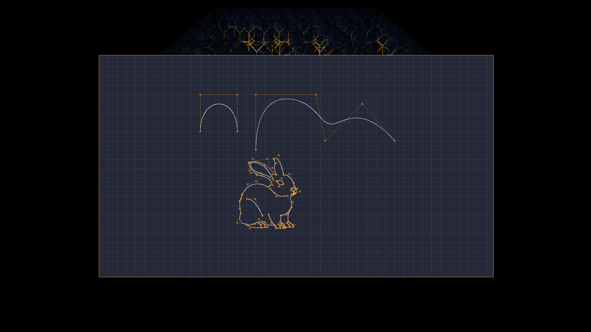
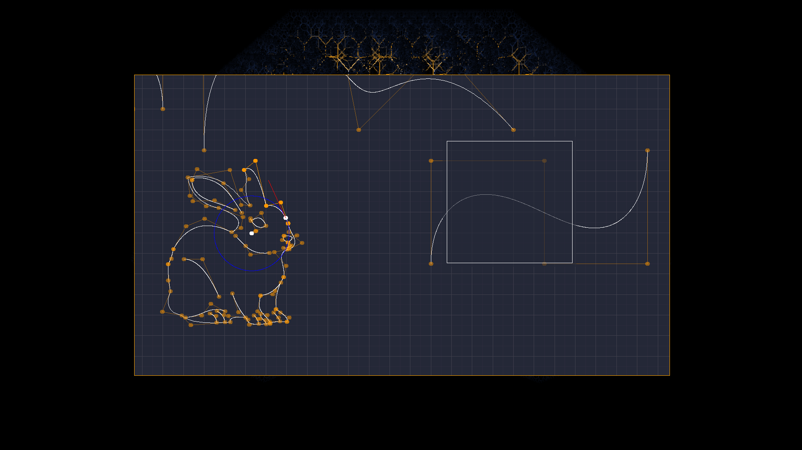
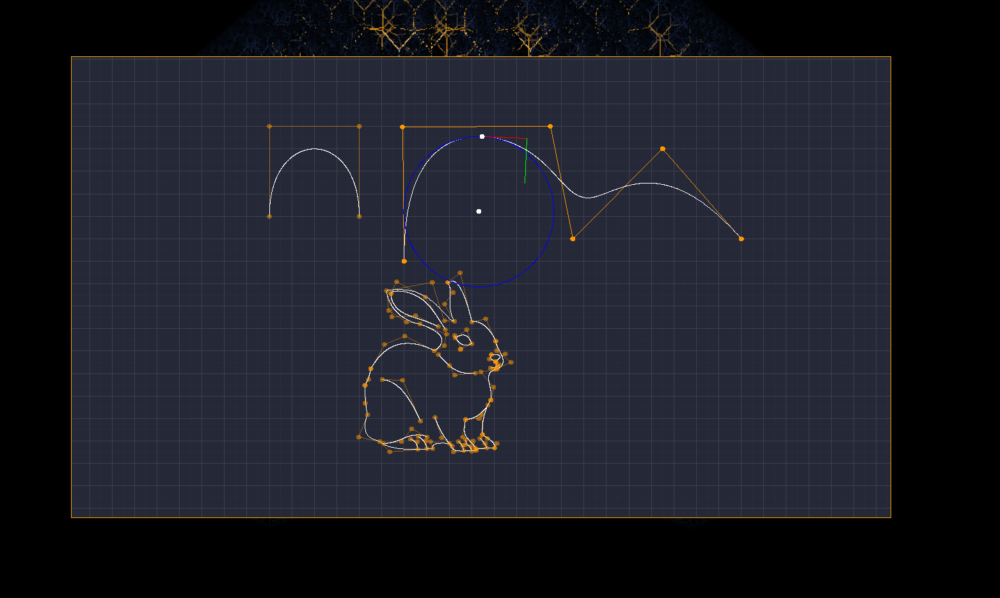
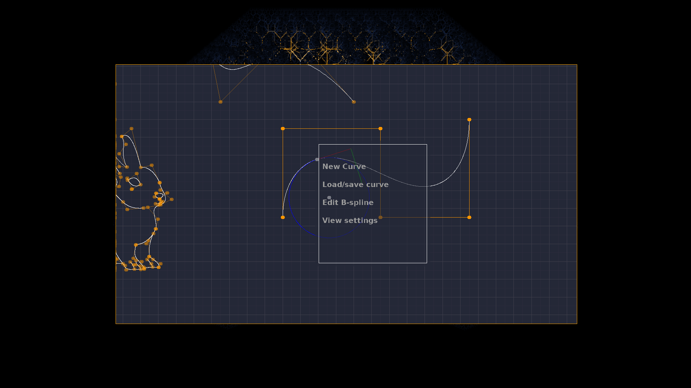
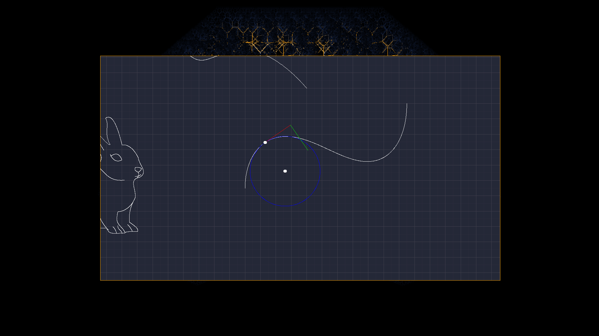
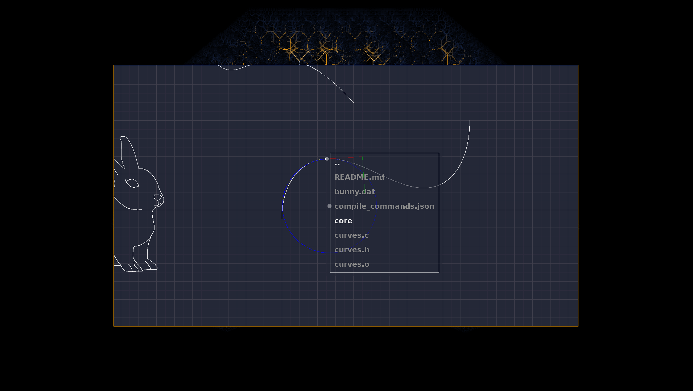

# Proton

A Bezier and B-spline curver editor written in C + SDL.

## Features
> **Fully animated GUI writtein in SDL**
> **intuitive control polygon editing**
> **Intuitive knot vector editing**
> **Automatic curve connection with support for C0, C1, G1 continuity**
> **Import/Export of curves into the custom .dat file format.**                
> **Normal/Tangnet/Osculating circle visualization.**

## Images
> 
> 
> 
> 
> 
> 
> 

#Big thanks to the folks at the Technion for providing the data directory.
